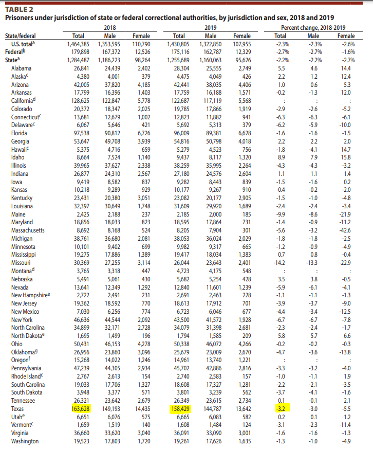

# Incarceration rate

The number of sentenced prisoners under the jurisdiction of state or federal correctional authorities per 100,000 people

## Justice & Safety

### Goal: Justice system

Texans are served effectively, efficiently, and impartially by the justice system

### Type: Secondary indicator

Updated: yes

Data Release Date: 

Comparisons: States

Date: 2019

Latest Value: 158,429 

State Rank: 1

Peer Rank: 

Previous Date: 2018

Previous Value: 163,628

Previous State Rank: 1

Metric Trend: up

Target: 

Baseline: 

Previous Target Value: 

Previous Trend: 

Previous Peer Rank: 

Previous State Rank (og): 

### Value

| Year |  Value      | Rank     | Previous Year   | Previous Value | Previous Rank | Trend | 
| ----------- | ----------- | ----------- | ----------- | ----------- | ----------- | -----------|
|    2019     |158,429      | 1           |     2018    |   163,628   | 1        | up       | 

### Data

### Source

[TX - LBB - Monthly Report](https://www.lbb.state.tx.us/Documents/Publications/Info_Graphic/812_MonthlyReport_FY2021.pdf)

[BJS - Federal & State Counts - 2019](https://bjs.ojp.gov/content/pub/pdf/p19.pdf)

[BJS - Federal & State Counts - 2018](https://bjs.ojp.gov/content/pub/pdf/p18.pdf)

### Notes

### Indicator Page

N/A

### DataLab Page

N/A