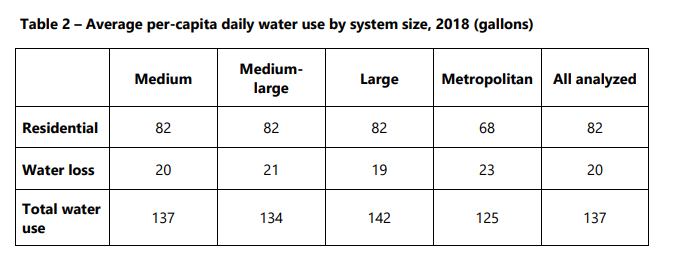
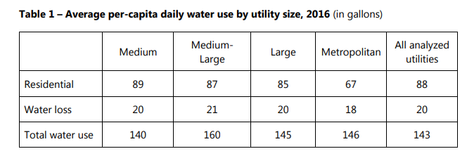

# Daily water use per person
Amount of residential water used per day per capita, delivered through Texas water utilities
## Water
### Goal: Sufficient water
Texans can rely on a sufficient water supply
### Type: Secondary indicator
Updated: yes
Data Release Date: 

Comparisons: States

### Value

| Year      |  Value      | Rank        | Previous Year | Previous Value | Previous Rank | Trend | 
| ----------- | ----------- | ----------- | ----------- | ----------- | ----------- | -----------|
|   2018       |    82      |             |      2016   |     88      |             |    up      | 

\* gallons

### Data

### Source

[Water Use of Texas Water Utilites - 2020](http://www.twdb.texas.gov/publications/reports/special_legislative_reports/doc/2021_WaterUseofTexasWaterUtilities.pdf)

[Previous Source](http://www.twdb.texas.gov/publications/reports/special_legislative_reports/doc/Water-Use-of-Texas-Water-Utilities-86th-Legislative.pdf)

### Notes

### Indicator Page

### DataLab Page