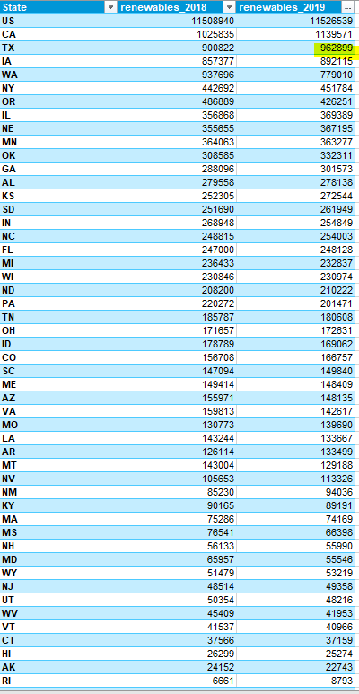
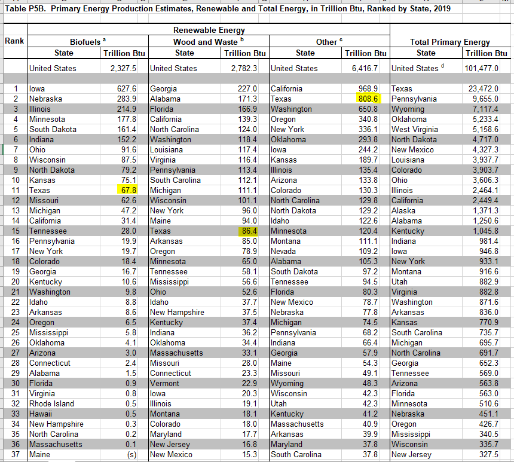

# Renewable energy production

Energy content generated from renewable sources in-state

## Land

### Goal: Energy production

Texas leads in energy production with responsible natural resource stewardship

### Type: Primary indicator

Updated: yes

Data Release Date: 

Comparisons: States

----

Date: 2019

Latest Value: 962899

State Rank: 2

Peer Rank: 2

----

Previous Date:  2018

Previous Value: 900822

Previous State Rank:   2

Previous Peer Rank: 3

----
Metric Trend: up

Target: Rank 1

Baseline: 786

Target Value: 1120

Previous Trend: Improving

### Value

| Year      |  Value      | Rank        | Previous Year | Previous Value | Previous Rank | Trend | 
| ----------- | ----------- | ----------- | ----------- | ----------- | ----------- | -----------|
|   2019       | 962899     |  2         |      2018   |   900822   |      3    |    up       | 

\* Billion BTU

### Data

### Source

[EIA - SEDS](https://www.eia.gov/state/seds/seds-data-complete.php?sid=US#StatisticsIndicators)

[Renewables ](https://www.eia.gov/electricity/data/browser/#/topic/0?agg=2,0,1&fuel=06&geo=g0fvvvvvvvvvo&sec=g&linechart=ELEC.GEN.HYC-US-99.A&columnchart=ELEC.GEN.HYC-US-99.A&map=ELEC.GEN.HYC-US-99.A&freq=A&ctype=linechart&ltype=pin&rtype=s&maptype=0&rse=0&pin=)

Table P5B

### Notes

### Indicator Page

[Indicator Link](https://indicators.texas2036.org/indicator/82)

### DataLab Page

[DataLab Link](https://datalab.texas2036.org/zsqgffc/us-regional-energy-data-energy-consumption-prices-expenditures-and-production-estimates?accesskey=bhihpdf)

