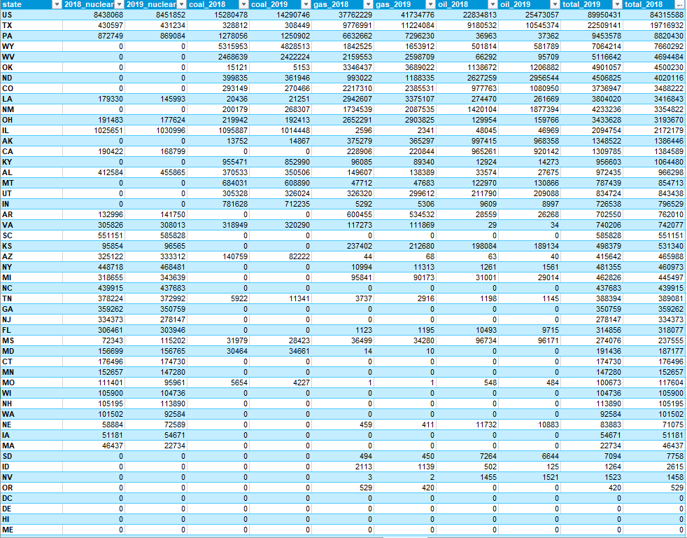
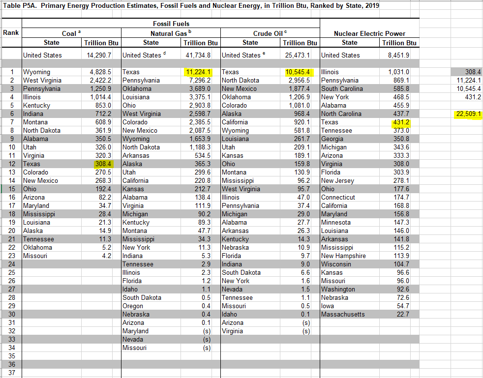

# Traditional energy production

Energy content of oil, natural gas, coal, and nuclear energy extracted from the ground or generated in-state

## Land

### Goal: Energy production

Texas leads in energy production with responsible natural resource stewardship

### Type: Primary indicator

Updated: yes

Data Release Date: 

Comparisons: States

----

Date: 2019

Latest Value: 22,509.1 

State Rank: 1

Peer Rank: 1

----

Previous Date: 2018

Previous Value: 19,716.93

Previous State Rank: 1

Previous Peer Rank: 1

----  

Metric Trend: up

Target: Rank 1

Baseline: 16787 billion BTU (2017)

Target Value: 16800

Previous Trend: Mixed

### Value

| Year      |  Value      | Rank        | Previous Year | Previous Value | Previous Rank | Trend | 
| ----------- | ----------- | ----------- | ----------- | ----------- | ----------- | -----------|
|   2019      |     22,509.1|     1       |      2018   |   19716932  |    1        |   flat     | 

### Data

### Source

[EIA - SEDS](https://www.eia.gov/state/seds/seds-data-complete.php?sid=US#StatisticsIndicators)

Table P5A

### Notes

### Indicator Page

[Indicator Link](https://indicators.texas2036.org/topics/81)

### DataLab Page

[DataLab Link](https://datalab.texas2036.org/zsqgffc/us-regional-energy-data-energy-consumption-prices-expenditures-and-production-estimates?accesskey=njoytfe)
