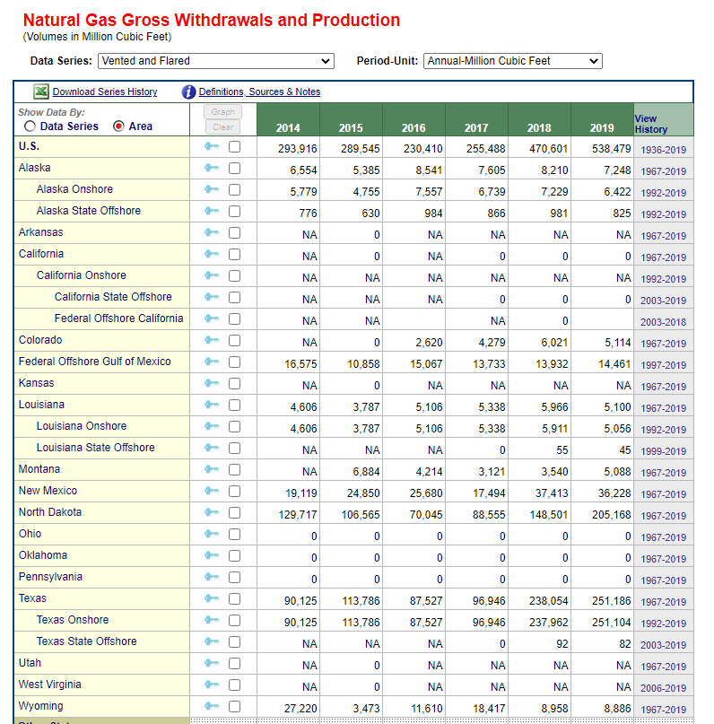

# Methane emissions

Gas disposed through venting and flaring per unit of oil and gas produced

## Land

### Goal: Energy production

Texas leads in energy production with responsible natural resource stewardship

### Type: Secondary indicator

Updated: yes

Data Release Date: 

Comparisons: States

----

Date: 2019

Latest Value: 251,186 

State Rank: 

Peer Rank: 

----

Previous Date: 2018

Previous Value: 238,054

Previous State Rank: 

Previous Peer Rank: 

----
Metric Trend: down

Target: 

Baseline: 

Target Value: 

Previous Trend: 

### Value

| Year      |  Value      | Rank        | Previous Year | Previous Value | Previous Rank | Trend | 
| ----------- | ----------- | ----------- | ----------- | ----------- | ----------- | -----------|
|   2019      |   251,186   |             |    2018     |   238,054   |             |    down    | 

### Data

### Source

[EIA - Natural Gas - 	Natural Gas Gross Withdrawals and Production](https://www.eia.gov/dnav/ng/ng_prod_sum_a_EPG0_VGV_mmcf_m.htm)

### Notes

### Indicator Page

N/A

### DataLab Page

N/A
