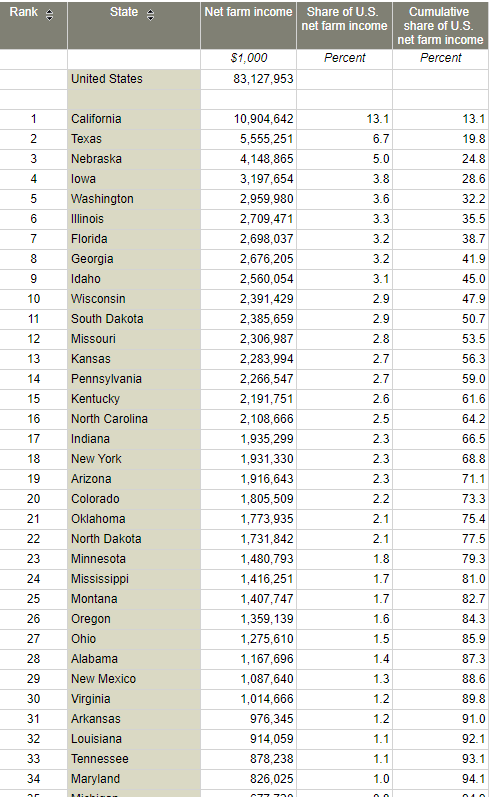

# Farm profitability
Net farm income measured by revenue less expenses from production in the current year
## Land
### Goal: Agricultural production
Texas leads in agricultural production with responsible natural resource stewardship
### Type: Secondary indicator
Updated: yes
Data Release Date: 

Comparisons: States

### Value

| Year      |  Value      | Rank        | Previous Year | Previous Value | Previous Rank | Trend | 
| ----------- | ----------- | ----------- | ----------- | ----------- | ----------- | -----------|
|   2019       | 5,555,251  |  2         |      2018   |   4,162,362      |      3    |    up  | 

\* 1,000s

### Data

### Source

[Farm finance indicators, state ranking, 2019](https://data.ers.usda.gov/reports.aspx?ID=17839#P014d0d56d2b14a109de84385f0c5c32c_14_185iT0R0x16)

### Notes

### Indicator Page

N/A

### DataLab Page

[DataLab Link](https://datalab.texas2036.org/rbpivhg/u-s-census-of-agriculture-economics-2017?accesskey=hruynag)