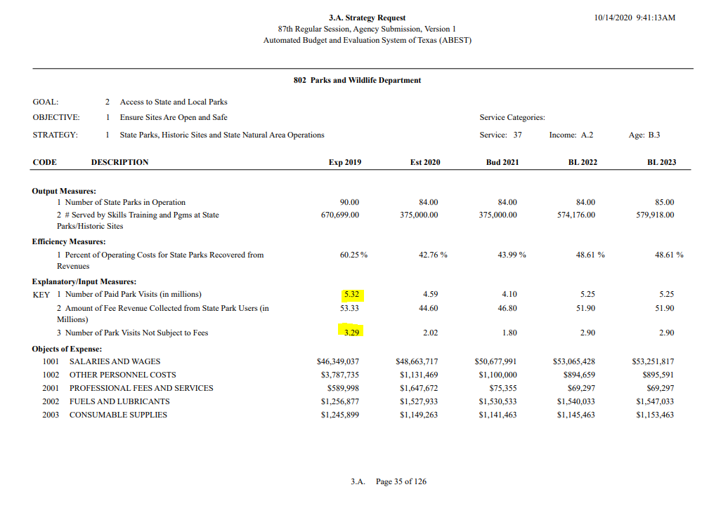
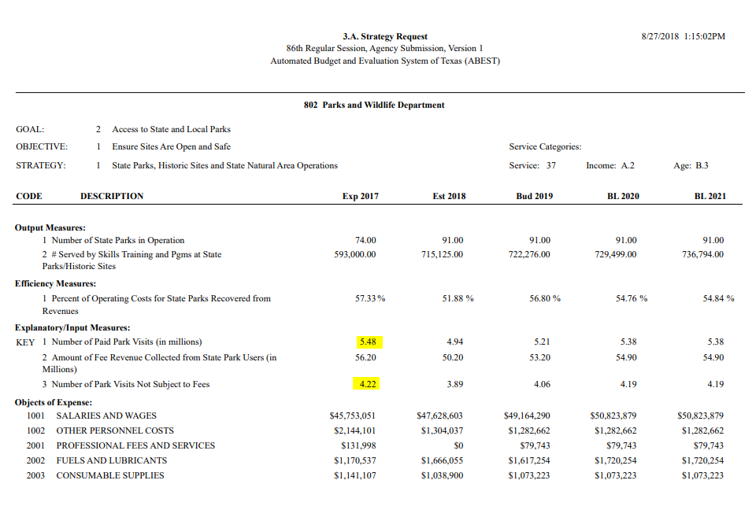

# Park utilization

Number of total visits to Texas state parks per 1,000 Texans

## Land

### Goal: Parks and wildlife

Texas enhances and protects its state parks, and public and private open spaces and wildlife

### Type: Primary indicator

Updated: yes

Data Release Date: 

Comparisons: Texas

Date: 2019

Latest Value: 296.89 

State Rank: N/A

Peer Rank: 

Previous Date: 2017

Previous Value: 342.76

Previous State Rank: N/A

Metric Trend: down

Target: 

Baseline: 

Previous Target Value: 

Previous Trend: 

Previous Peer Rank: 

Previous State Rank (og): 

### Value

| Year      |  Value      | Rank        | Previous Year | Previous Value | Previous Rank | Trend | 
| ----------- | ----------- | ----------- | ----------- | ----------- | ----------- | -----------|
|   2019      |    296.89   |      N/A    |     2017    |    342.76   |     N/A     |    down    |

### Data

2019:

2017:

8,771,744 - 2018 visits

2019:
8.61
29 (population)

2017:
9.7 
28.3 (population)

### Source

[TPWD - Request for Legislative Appropriations, 2022-23](https://tpwd.texas.gov/publications/pwdpubs/media/FY22-23-TPWD-LAR.pdf)

[TPWD - Request for Legislative Appropriations, 2020-2021](https://tpwd.texas.gov/publications/pwdpubs/media/FY20-21-TPWD-LAR.pdf)

[TPWF Economic Contributions of State Parks - 2018](https://www.tpwf.org/wp-content/uploads/2019/02/The-Economic-Contributions-of-State-Parks-2018-Report.pdf)

### Notes

### Indicator Page

[Indicator Link](https://indicators.texas2036.org/indicator/113)

### DataLab Page

