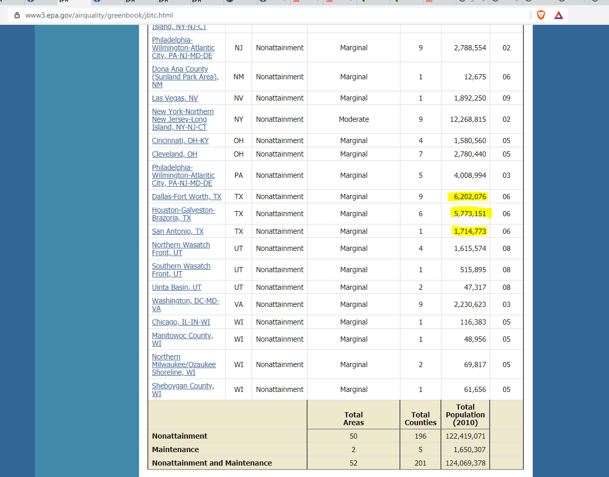

# Ozone pollution

Percent of population living in counties with 8-hour ozone values greater than the national standard

## Air

### Goal: Quality of air

Texans have clean air

### Type: Secondary indicator

Updated: no

Data Release Date: 

Comparisons: Counties

----

Date: 2015

Latest Value: 54.30%  (data is spotty, variable is at county level, no TX counties listed)

State Rank: 

Peer Rank: 

----

Previous Date: 

Previous Value: 

Previous State Rank: 

Previous Peer Rank: 

----
Metric Trend: 

Target: 

Baseline: 

Target Value: 

Previous Trend: 

### Value

| Year      |  Value      | Rank        | Previous Year | Previous Value | Previous Rank | Trend | 
| ----------- | ----------- | ----------- | ----------- | ----------- | ----------- | -----------|
|    2015     |   54.30%    |             |             |             |             |            |

### Data

### Source

[Green Book](https://www3.epa.gov/airquality/greenbook/jbtc.html)

### Notes

### Indicator Page

### DataLab Page

[DataLab Link](https://datalab.texas2036.org/onngqtd/air-quality-statistics-report?accesskey=lpmly)
