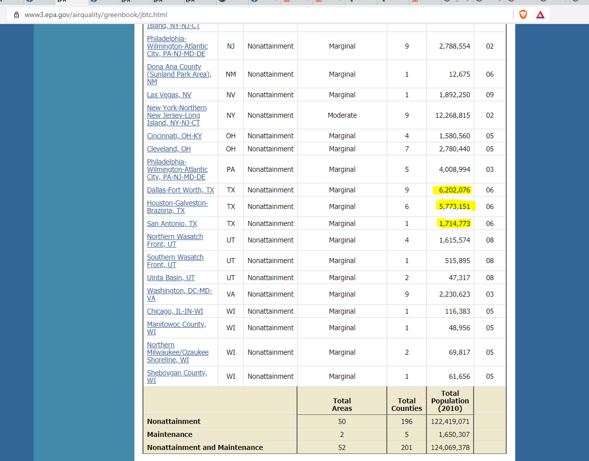

# Ozone pollution

Percent of population living in counties with 8-hour ozone values greater than the national standard

## Air

### Goal: Quality of air

Texans have clean air

### Type: Secondary indicator

Updated: yes

Data Release Date: 

Comparisons: Counties

### Value

| Year      |  Value      | Rank        | Previous Year | Previous Value | Previous Rank | Trend | 
| ----------- | ----------- | ----------- | ----------- | ----------- | ----------- | -----------|
|    2015     |   54.30%    |             |             |             |             |            |

### Data

### Source

[Green Book](https://www3.epa.gov/airquality/greenbook/jbtc.html)

### Notes

### Indicator Page

### DataLab Page

[DataLab Link](https://datalab.texas2036.org/onngqtd/air-quality-statistics-report?accesskey=lpmly)