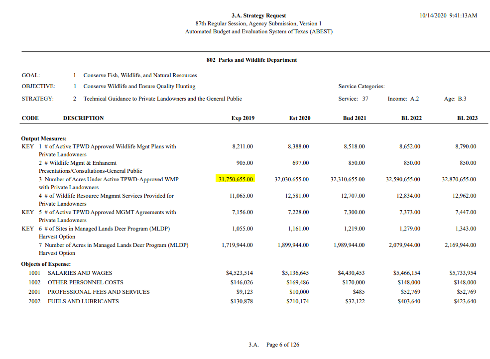

# Wildlife Plans with private landowners

Percent of total land acreage in Texas with approved Wildlife Management Plans with private landowners

## Land

### Goal: Parks and wildlife

Texas enhances and protects its state parks, and public and private open spaces and wildlife

### Type: Secondary indicator

Updated: yes

Data Release Date: 

Comparisons: Texas

----

Date: 2019

Latest Value: 18.47% 

State Rank: N/A (Texas only)

Peer Rank: 

----

Previous Date: 2017

Previous Value: 18.81%

Previous State Rank: N/A

Previous Peer Rank: 

----
Metric Trend: down

Target: 

Baseline: 

Target Value: 

Previous Trend: 

<!--### Value

| Year      |  Value      | Rank        | Previous Year | Previous Value | Previous Rank | Trend | 
| ----------- | ----------- | ----------- | ----------- | ----------- | ----------- | -----------|
|   2019      |   18.47%    |   N/A      |    2017     |   18.81%    |    N/A       |    down    | 

-->
### Data

2019:

31,750,655.00

2017:

32,328,036.00

Texas - Total Acres
171,891,840

### Source

[Texas Parks & Wildlife - Self Evaluation Report (August 2019)](https://tpwd.texas.gov/publications/nonpwdpubs/media/tpwd_sunset_self_evaluation_report_2019.pdf)

### Notes

7,000 private landowners who have
active wildlife management plans on more than 31 million acres.

Provides assistance in developing 7,067 wildlife management plans designed to meet the
landowners’ overall land management goals on about 31.2 million acres of private lands.

### Indicator Page

### DataLab Page
