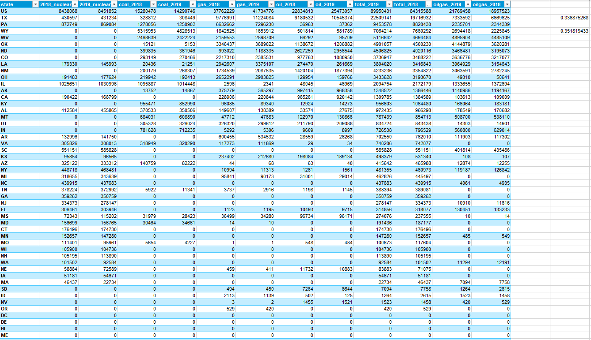
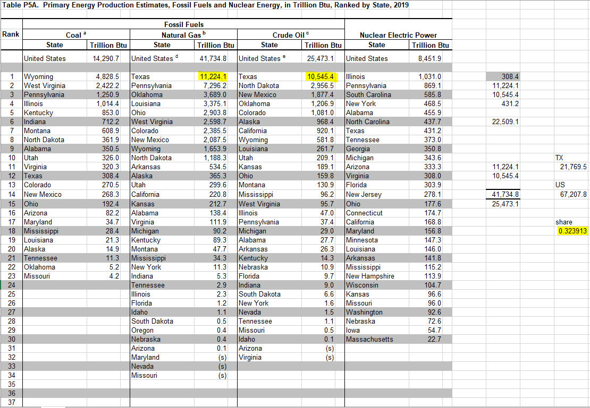

# Share of oil and gas production

Total oil and gas production in Texas, as a percent of total US production

## Land

### Goal: Energy production

Texas leads in energy production with responsible natural resource stewardship

### Type: Secondary indicator

Updated: yes

Data Release Date: 

Comparisons: States

----

Date: 2019

Latest Value: 33.69% 

State Rank: 1

Peer Rank: 

----

Previous Date: 2018

Previous Value: 35.18%

Previous State Rank: 1

Previous Peer Rank: 

----
Metric Trend: flat

Target: 

Baseline: 

Target Value: 

Previous Trend: 

### Value

| Year      |  Value      | Rank        | Previous Year | Previous Value | Previous Rank | Trend | 
| ----------- | ----------- | ----------- | ----------- | ----------- | ----------- | -----------|
|   2019       | 33.69%     |  1         |      2018   |  35.18%      |      1    |    flat       | 

### Data

### Source

[EIA - SEDS](https://www.eia.gov/state/seds/seds-data-complete.php?sid=US#StatisticsIndicators)

Table P5A

### Notes

### Indicator Page

N/A

### DataLab Page

[DataLab Link](https://datalab.texas2036.org/zsqgffc/us-regional-energy-data-energy-consumption-prices-expenditures-and-production-estimates?accesskey=gjqmppd)
