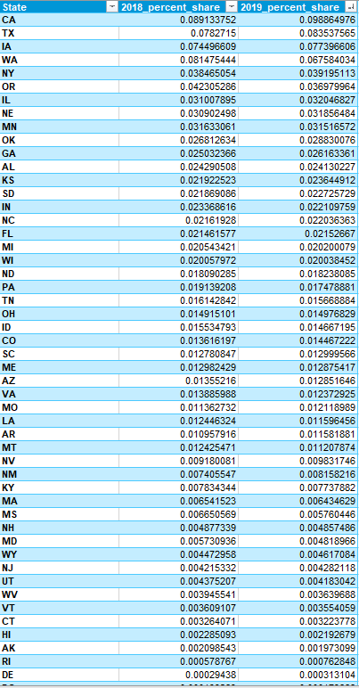
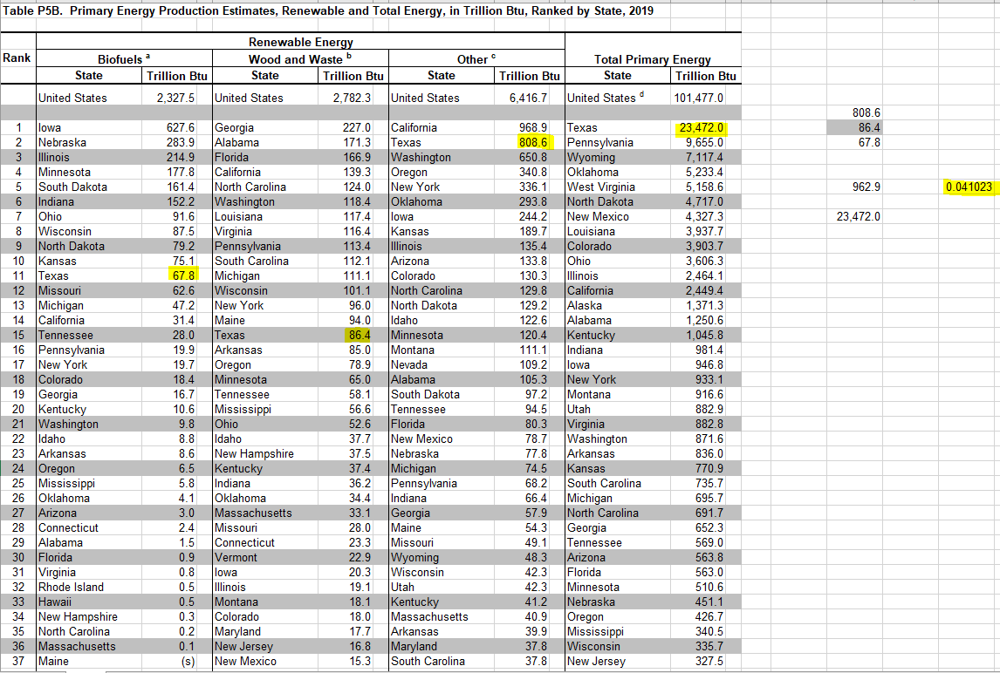

# Total renewable energy produced in-state, as a percent of total US production

## Natural Resources

### Primary Indicator

### Goal

Energy production

Texas leads in energy production with responsible natural resource stewardship

### Value

| Year        |  Value      | Rank        | Previous Year | Previous Value | Previous Rank | Trend| 
| ----------- | ----------- | ----------- | ----------- | ----------- | ----------- | -----------|
|   2019       | 8.35%       |     2      |      2018   |   7.82%      |      3     |    up      | 

### Data

Share of Production by state:

This is calcuated differently, just for 2019:

### Source

[EIA - SEDS](https://www.eia.gov/state/seds/seds-data-complete.php?sid=US#StatisticsIndicators)

[Renewables ](https://www.eia.gov/electricity/data/browser/#/topic/0?agg=2,0,1&fuel=06&geo=g0fvvvvvvvvvo&sec=g&linechart=ELEC.GEN.HYC-US-99.A&columnchart=ELEC.GEN.HYC-US-99.A&map=ELEC.GEN.HYC-US-99.A&freq=A&ctype=linechart&ltype=pin&rtype=s&maptype=0&rse=0&pin=)

Table P5B

### Notes

This is (total texas production of renewables) / (total us production of renewables)

Can do other calculations if that isn't the correct measure.

### Indicator Page

[Indicator Link](https://indicators.texas2036.org/indicator/85)

### DataLab Page

[DataLab Link](https://datalab.texas2036.org/zsqgffc/us-regional-energy-data-energy-consumption-prices-expenditures-and-production-estimates?accesskey=bhihpdf)