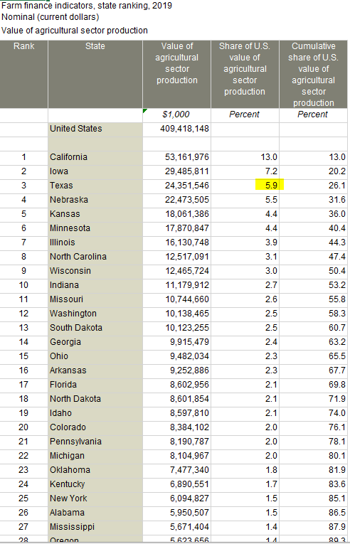

# Share of national agricultural output

Value of agricultural output from Texas, as a percent of total US agricultural output

## Land

### Goal: Agricultural production

Texas leads in agricultural production with responsible natural resource stewardship

### Type: Secondary indicator

Updated: yes

Data Release Date: 

Comparisons: States

----

Date: 2019

Latest Value: 5.9

State Rank: 4

Peer Rank: 2

----

Previous Date:  2018

Previous Value: 6

Previous State Rank:   2

Previous Peer Rank: 2

----
Metric Trend: flat

Target: 

Baseline: 

Target Value: 

Previous Trend: 

### Value

| Year      |  Value      | Rank        | Previous Year | Previous Value | Previous Rank | Trend | 
| ----------- | ----------- | ----------- | ----------- | ----------- | ----------- | -----------|
|   2019       | 5.9%       |  3         |      2018   |   6.0%      |      3    |    flat       | 

### Data

### Source

[Farm finance indicators State ranking](https://data.ers.usda.gov/reports.aspx?ID=17839#P014d0d56d2b14a109de84385f0c5c32c_7_185iT0R0x3)

### Notes

### Indicator Page

N/A

### DataLab Page

[DataLab Link](https://datalab.texas2036.org/rqtpwne/u-s-and-state-farm-income-and-wealth-statistics?accesskey=tfdxddc)
