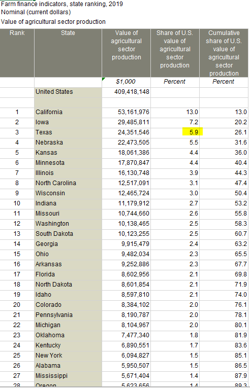

# Share of national agricultural output
Value of agricultural output from Texas, as a percent of total US agricultural output
## Land
### Goal: Agricultural production
Texas leads in agricultural production with responsible natural resource stewardship
### Type: Secondary indicator
Updated: yes
Data Release Date: 

### Value

| Year      |  Value      | Rank        | Previous Year | Previous Value | Previous Rank | Trend | 
| ----------- | ----------- | ----------- | ----------- | ----------- | ----------- | -----------|
|   2019       | 5.9%       |  3         |      2018   |   6.0%      |      3    |    flat       | 

### Data

### Source

[Farm finance indicators State ranking](https://data.ers.usda.gov/reports.aspx?ID=17839#P014d0d56d2b14a109de84385f0c5c32c_7_185iT0R0x3)

### Notes

### Indicator Page

N/A

### DataLab Page

[DataLab Link](https://datalab.texas2036.org/rqtpwne/u-s-and-state-farm-income-and-wealth-statistics?accesskey=tfdxddc)
