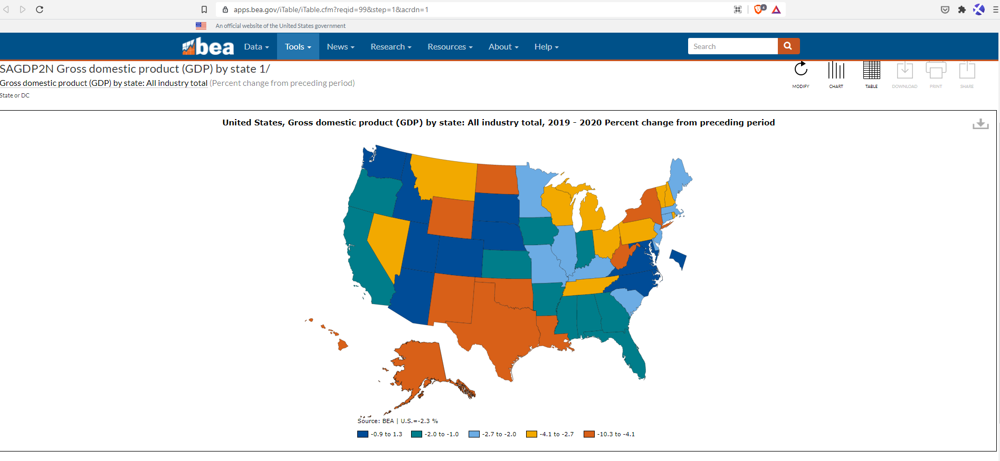
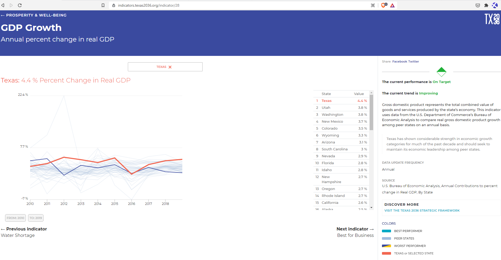
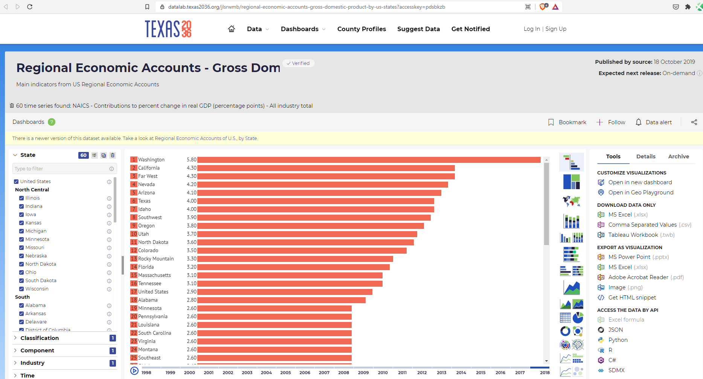

# Annual percent change in real GDP

## Prosperity & Well Being

### Secondary Indicator

### **Goal**

Economic growth

Texas spurs economic growth through an innovative and business-friendly climate

### **Value**

| Year |  Value      | Rank     | Previous Year   | Previous Value | Previous Rank | Trend | 
| ----------- | ----------- | ----------- | ----------- | ----------- | ----------- | -----------|
|    2020     |    -4.6%     | N/A         |    2019     |    2.7%    | N/A         | 📈        | 

### Data

### Source

[Map](https://apps.bea.gov/iTable/iTable.cfm?reqid=99&step=1&acrdn=1)

[BEA](https://www.bea.gov/data/gdp/gdp-state)

### Notes

### Indicator Page

[Indicator Link](https://indicators.texas2036.org/indicator/28)

### DataLab Page

[DataLab Link](https://datalab.texas2036.org/jlsrwmb/regional-economic-accounts-gross-domestic-product-by-us-states?accesskey=pdsbkzb)

