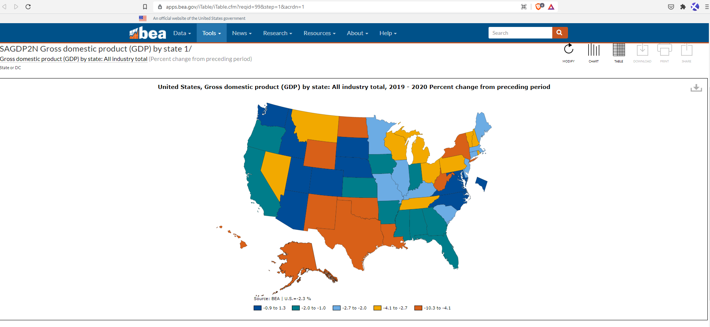
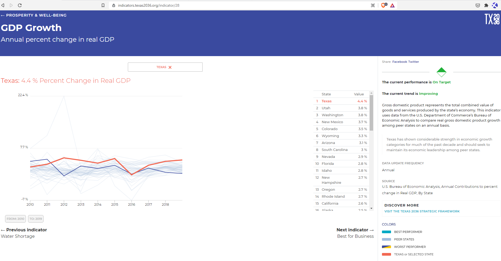
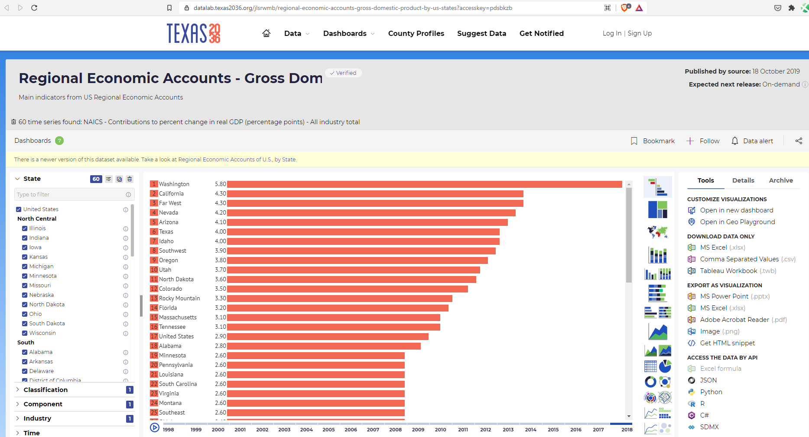

# GDP growth

Annual percent change in real GDP

## Prosperity

### Goal: Economic growth

Texas spurs economic growth through an innovative and business-friendly climate

### Type: Primary indicator

Updated: yes

Data Release Date: Quarterly

Comparisons: States

----

Date: 2020

Latest Value: -2.9%

State Rank: 23

Peer Rank: 6

----

Previous Date:  2019

Previous Value: 3.2%

Previous State Rank: 11

Previous Peer Rank: 5

----

Metric Trend: down

Target: #1

Baseline: 4%

Target Value: 4%

Previous Trend: Improving

### Value

| Year |  Value      | Rank     | Previous Year   | Previous Value | Previous Rank | Trend | 
| ----------- | ----------- | ----------- | ----------- | ----------- | ----------- | -----------|
|    2020     |    -4.6%     | N/A         |    2019     |    2.7%    | N/A         | down        | 

### Data

### Source

[Map](https://apps.bea.gov/iTable/iTable.cfm?reqid=99&step=1&acrdn=1)

[BEA](https://www.bea.gov/data/gdp/gdp-state)

### Notes

Change in GDP was calculated from the first quarter of 2020 to the first quarter of 2021.

### Indicator Page

[Indicator Link](https://indicators.texas2036.org/indicator/28)

### DataLab Page

[DataLab Link](https://datalab.texas2036.org/jlsrwmb/regional-economic-accounts-gross-domestic-product-by-us-states?accesskey=pdsbkzb)

