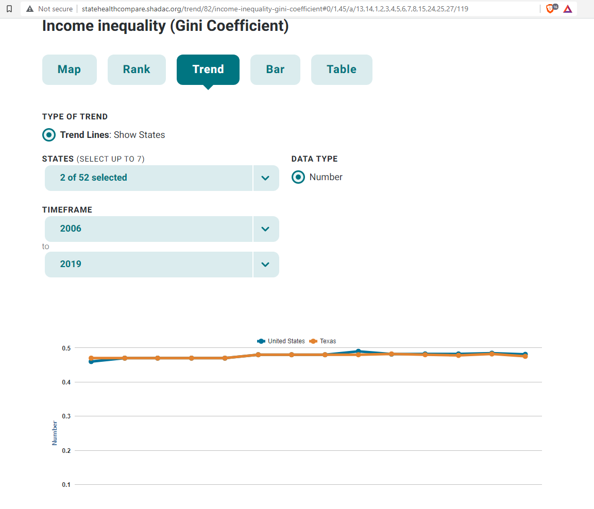
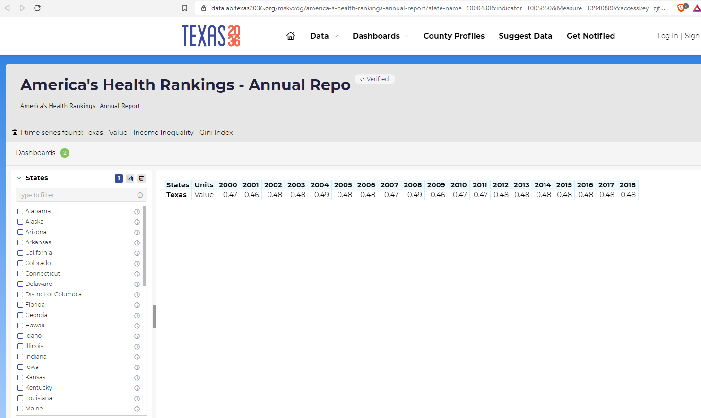

# Income inequality

Gini index of income inequality

## Prosperity

### Goal: Quality of life

Texas is the best place to live and work

### Type: Secondary indicator

Updated: yes

Data Release Date: 

Comparisons: States

----

Date: 

Latest Value: .48 

State Rank: 38

Peer Rank: 

----

Previous Date: 

Previous Value: .48

Previous State Rank: 37

Previous Peer Rank: 

----
Metric Trend: flat

Target: 

Baseline: 

Target Value: 

Previous Trend: 

### Value

| Year |  Value      | Rank     | Previous Year   | Previous Value | Previous Rank | Trend | 
| ----------- | ----------- | ----------- | ----------- | ----------- | ----------- | -----------|
|             |     .48     | 38        |             |      .48       | 37        | flat       | 

### Data

### Source

[Shadac](http://statehealthcompare.shadac.org/table/82/income-inequality-gini-coefficient#1/a/27/119)

### Notes

### Indicator Page

N/A

### DataLab Page

[DataLab Link](https://datalab.texas2036.org/mskvxdg/america-s-health-rankings-annual-report?state-name=1000430&indicator=1005850&Measure=13940880&accesskey=zjtgrfb)

