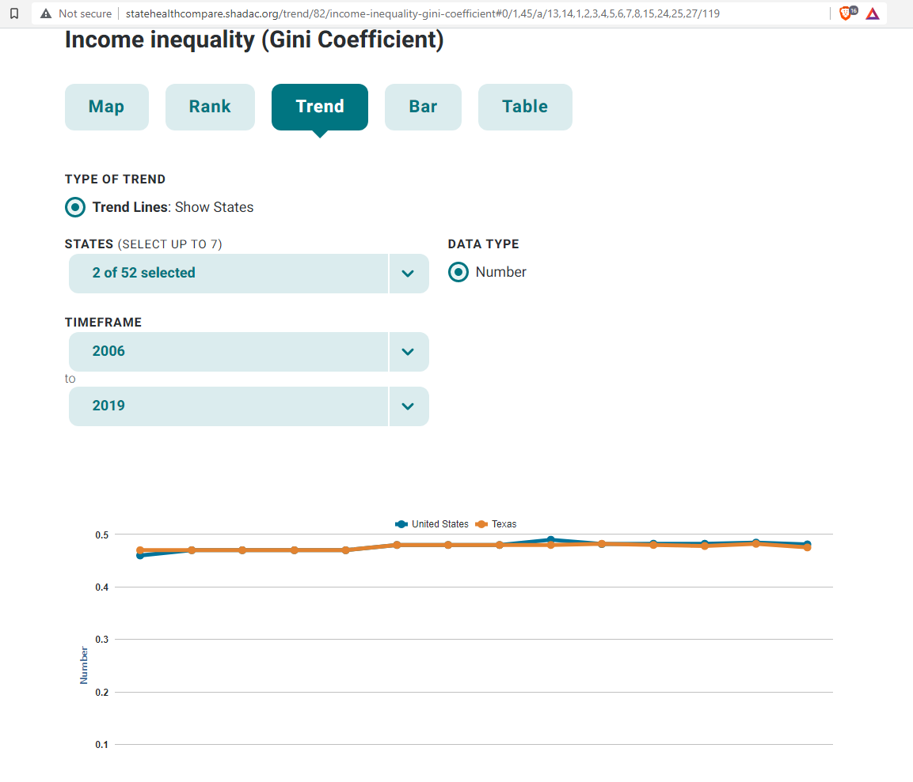
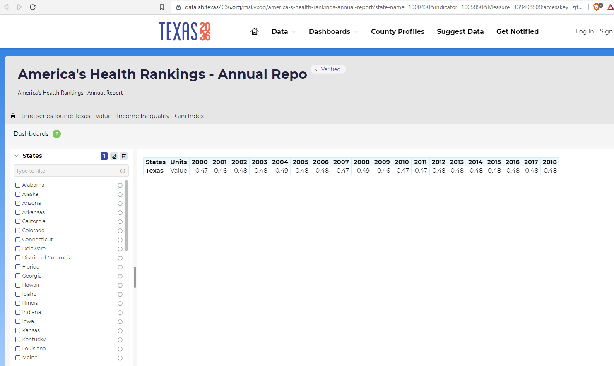

# Gini index of income inequality

## Prosperity & Well Being

### Secondary Indicator

### **Goal**

### **Goal**

Quality of life

Texas is the best place to live and work

### **Value**

|  Value      | Rank        | Previous Value | Previous Rank | Trend | 
| ----------- | ----------- | ----------- | ----------- | -----------|
|     .48     | 38        |      .48       | 37        | flat       | 

### Data

### Source

[Shadac](http://statehealthcompare.shadac.org/table/82/income-inequality-gini-coefficient#1/a/27/119)

### Notes

### Indicator Page

N/A

### DataLab Page

[DataLab Link](https://datalab.texas2036.org/mskvxdg/america-s-health-rankings-annual-report?state-name=1000430&indicator=1005850&Measure=13940880&accesskey=zjtgrfb)

