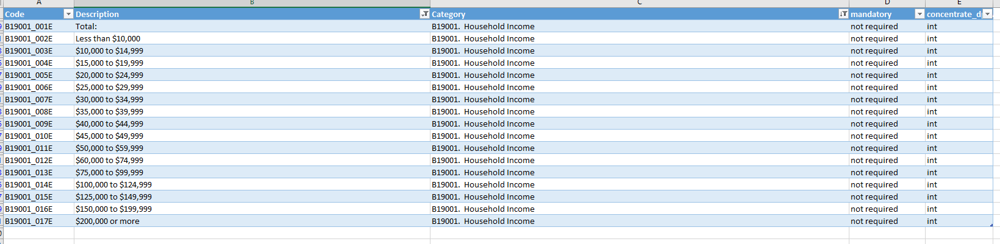

# Income inequality Distribution

ratio of the number of residents making below 30k vs. the number making above 200k

## Prosperity

### Goal: Shared Prosperity

Texas is the best place to live and work

### Type: Secondary indicator

Updated: yes

Data Release Date: 

Comparisons: States

### Value

| Year |  Value      | Rank     | Previous Year   | Previous Value | Previous Rank | Trend | 
| ----------- | ----------- | ----------- | ----------- | ----------- | ----------- | -----------|
|    2019     |    3.18     |    34       |     2018    |   3.61     |    34    |   flat    | 

### Data

### Source

[Census]

### Notes

the ratio of the number making below 30k vs. the number making above 200k by state. 

### Indicator Page

N/A

### DataLab Page

[DataLab Link](https://datalab.texas2036.org/mskvxdg/america-s-health-rankings-annual-report?state-name=1000430&indicator=1005850&Measure=13940880&accesskey=zjtgrfb)

