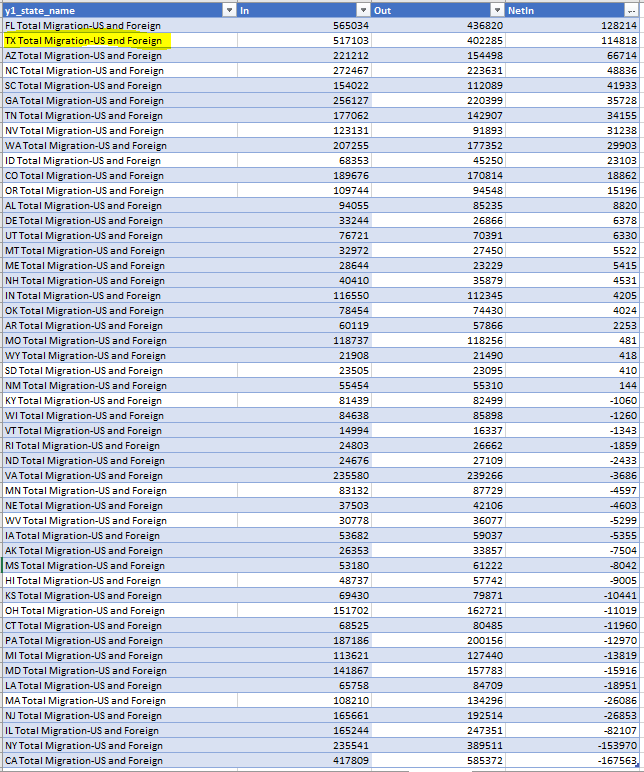
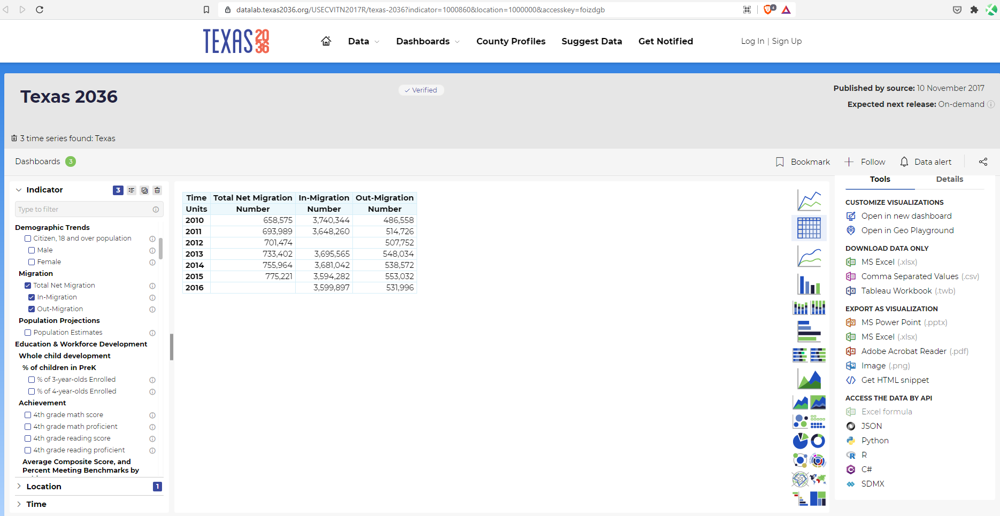

# Net Migration Gain

Net domestic migration gain or loss

## Prosperity

### Goal: Quality of life

Texas is the best place to live and work

### Type: Secondary indicator

Updated: yes

Data Release Date: 

Comparisons: States

----

Date: 2019

Latest Value: 114818

State Rank: 3

Peer Rank: 2

----

Previous Date:  2018

Previous Value: 80607

Previous State Rank:   3

Previous Peer Rank: 2

----
Metric Trend: up

Target: 

Baseline: 

Target Value: 

Previous Trend: 

### Value

| Year |  Value      | Rank     | Previous Year   | Previous Value | Previous Rank | Trend | 
| ----------- | ----------- | ----------- | ----------- | ----------- | ----------- | -----------|
|   2019     |   114,818   | 2        |   2018     |      80,607       | 2         | up        | 

### Data

### Source

[IRS - Migration Data](https://www.irs.gov/statistics/soi-tax-stats-migration-data-2018-2019)

[Previous Source](https://www.census.gov/data/tables/time-series/demo/geographic-mobility/state-to-state-migration.html)

### Notes

### Indicator Page

N/A

### DataLab Page

[DataLab Link](https://datalab.texas2036.org/USECVITN2017R/texas-2036?indicator=1000860&location=1000000&accesskey=foizdgb)

