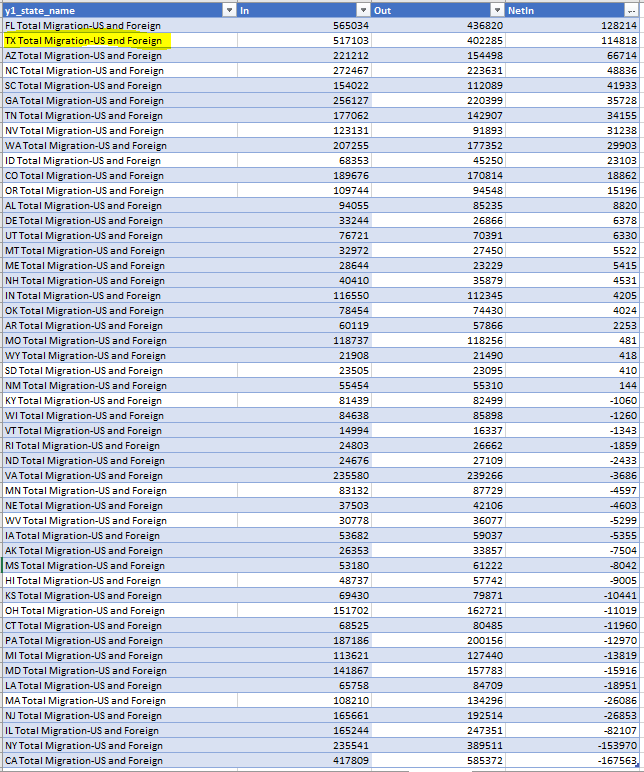
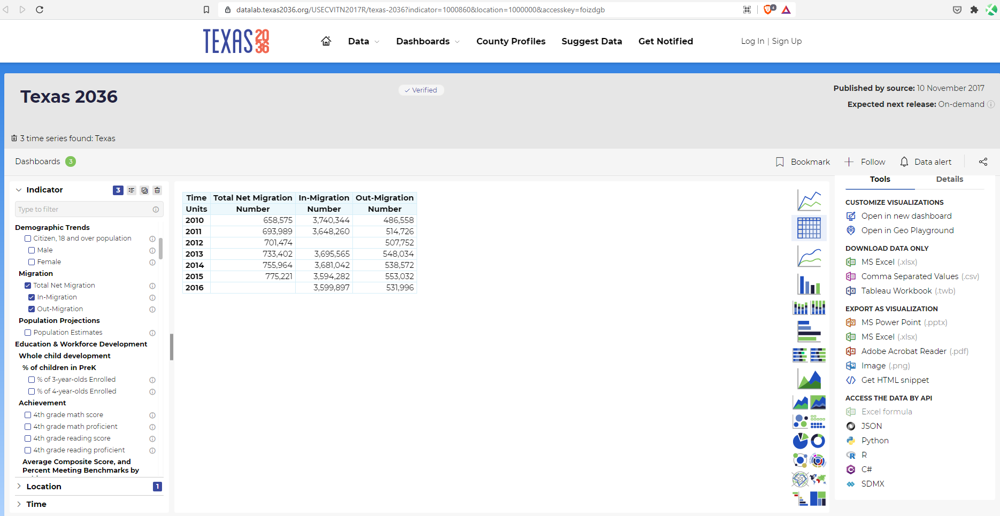

# Net domestic migration gain or loss

## Prosperity & Well Being

### Secondary Indicator

### **Goal**

Quality of life

Texas is the best place to live and work

### **Value**

|  Value      | Rank        | Previous Value | Previous Rank | Trend | 
| ----------- | ----------- | ----------- | ----------- | -----------|
|   114,818   | 2        |      80,607       | 2         | up        | 

### Data

### Source

[IRS - Migration Data](https://www.irs.gov/statistics/soi-tax-stats-migration-data-2018-2019)

[Previous Source](https://www.census.gov/data/tables/time-series/demo/geographic-mobility/state-to-state-migration.html)

### Notes

### Indicator Page

N/A

### DataLab Page

[DataLab Link](https://datalab.texas2036.org/USECVITN2017R/texas-2036?indicator=1000860&location=1000000&accesskey=foizdgb)

