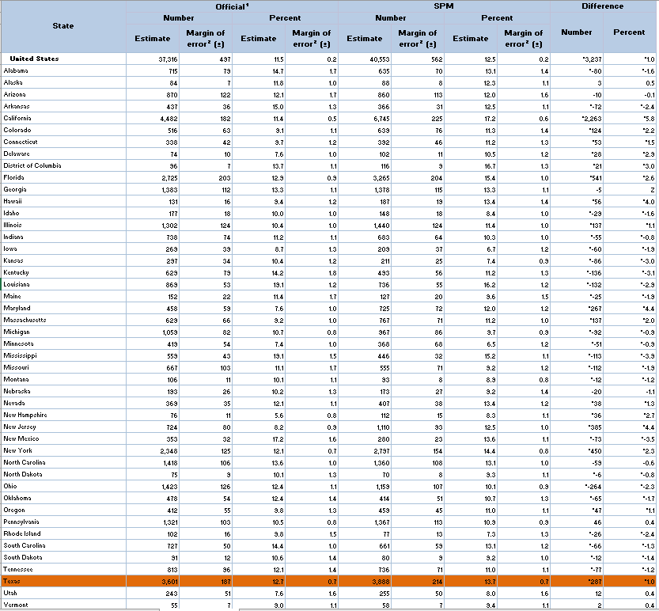

# Supplemental poverty rate

Percent of population below the supplemental poverty line

## Justice & Safety

### Goal: Safety net

Texans have access to resources to meet basic needs when they are in crisis

### Type: Primary indicator

Updated: yes

Data Release Date: 

Comparisons: States

### Value

| Year |  Value      | Rank     | Previous Year   | Previous Value | Previous Rank | Trend | 
| ----------- | ----------- | ----------- | ----------- | ----------- | ----------- | -----------|
|    2019     |     13.7%    | 45        |    2018     |    14.2%     | 43         | flat        | 

### Data

### Source

[Census - The Supplemental Poverty Measure: 2019](https://www.census.gov/library/publications/2020/demo/p60-272.html)

[Census - The Supplemental Poverty Measure: 2018](https://www.census.gov/library/publications/2019/demo/p60-268.html)

### Notes

### Indicator Page

N/A

### DataLab Page

<!-- [DataLab Link](https://datalab.texas2036.org/USECVITN2017V1/texas-2036?indicator=1008860&location=1000000&accesskey=ylfnfbb) -->

