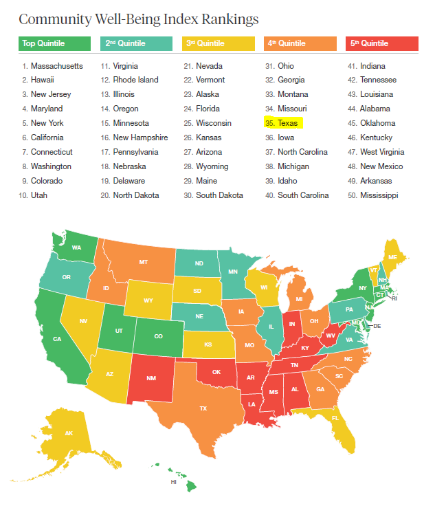
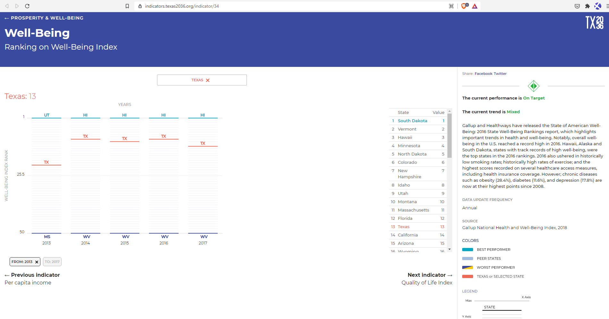
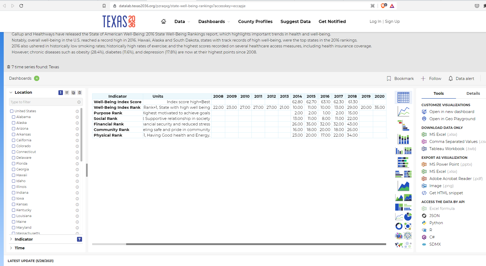

# Well-Being

Ranking on Gallup National Health and Well-Being Index

## Prosperity

### Goal: Quality of life

Texas is the best place to live and work

### Type: Secondary indicator

Updated: yes

Data Release Date: 

Comparisons: States

Date: 2020

Latest Value: N/A 

State Rank: 35

Peer Rank: 

Previous Date: 2019

Previous Value: N/A

Previous State Rank: 25

Metric Trend: down

Target: 

Baseline: 

Previous Target Value: 

Previous Trend: 

Previous Peer Rank: 

Previous State Rank (og): 

### Value

| Year |  Value      | Rank     | Previous Year   | Previous Value | Previous Rank | Trend | 
| ----------- | ----------- | ----------- | ----------- | ----------- | ----------- | -----------|
|    2020     |     N/A     | 35          |     2019    |     N/A     | 25         | down        | 

### Data

### Source

[Gallup - Well-Being Index](https://wellbeingindex.sharecare.com/download-reports/?submissionGuid=1a490b8f-54d0-48a9-bdaa-c22fd959a46b)

[2020 Report](./MCCS-7746-Sharecare-Community-Well-being-Index_2020-State-Rankings.pdf)

### Notes

### Indicator Page

[Indicator Link](https://indicators.texas2036.org/indicator/34)

### DataLab Page

[DataLab Link](https://datalab.texas2036.org/pzraqxg/state-well-being-rankings?accesskey=eccapje)

