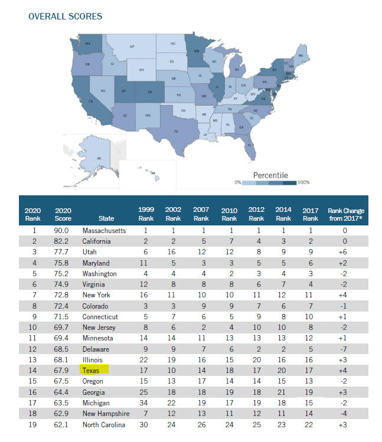
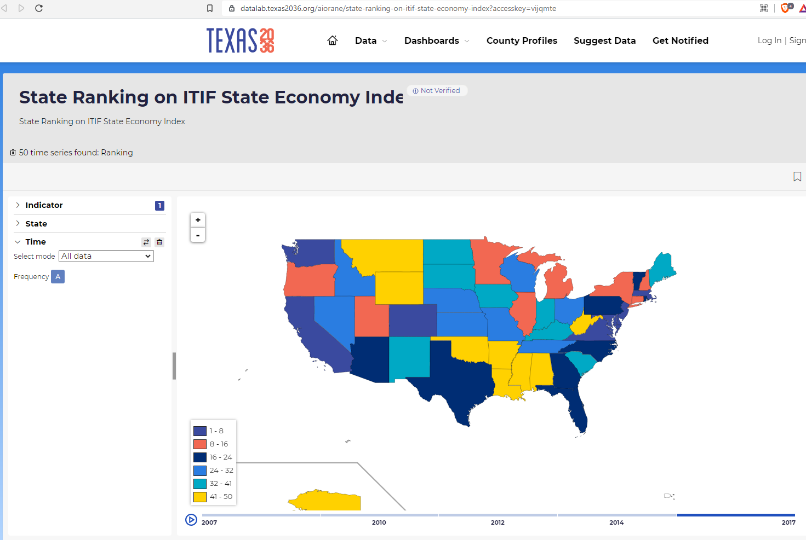

# New Economy

Ranking on ITIF State New Economy Index

## Prosperity

### Goal: Economic growth

Texas spurs economic growth through an innovative and business-friendly climate

### Type: Secondary indicator

Updated: yes

Data Release Date: 

Comparisons: States

Date: 2020

Latest Value: 67.9 

State Rank: 14

Peer Rank: 

Previous Date: 2017

Previous Value: 

Previous State Rank: 17

Metric Trend: up

Target: 

Baseline: 

Previous Target Value: 

Previous Trend: 

Previous Peer Rank: 

Previous State Rank (og): 

### Value

| Year |  Value      | Rank     | Previous Year   | Previous Value | Previous Rank | Trend | 
| ----------- | ----------- | ----------- | ----------- | ----------- | ----------- | -----------|
|    2020     |    67.9     | 14          |    2017     |             | 17          | up         | 

### Data

### Source

[ITIF](https://itif.org/publications/2020/10/19/2020-state-new-economy-index)

[2020 Report](./2020-state-new-economy-index.pdf)

### Notes

### Indicator Page

N/A

### DataLab Page

[DataLab Link](https://datalab.texas2036.org/aiorane/state-ranking-on-itif-state-economy-index?accesskey=vijqmte)

