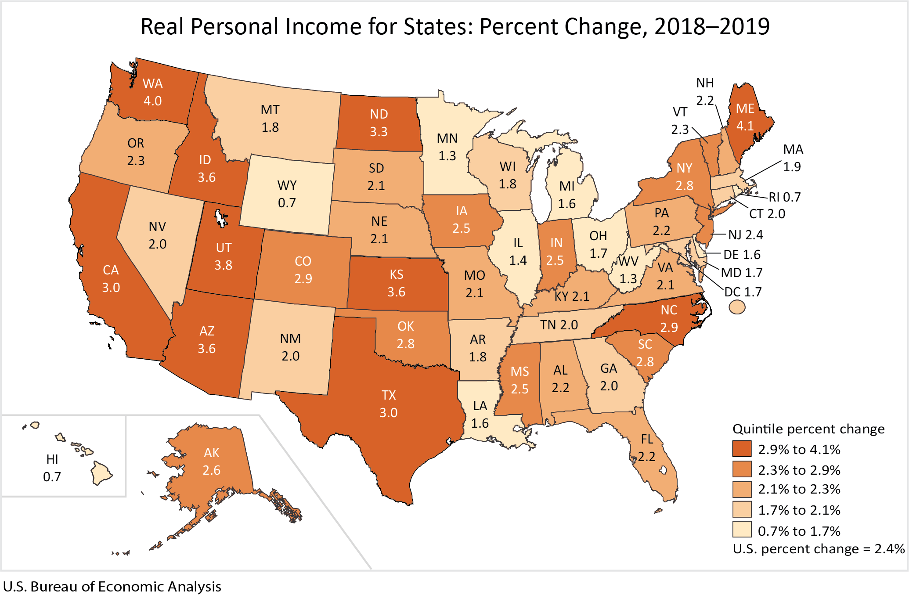
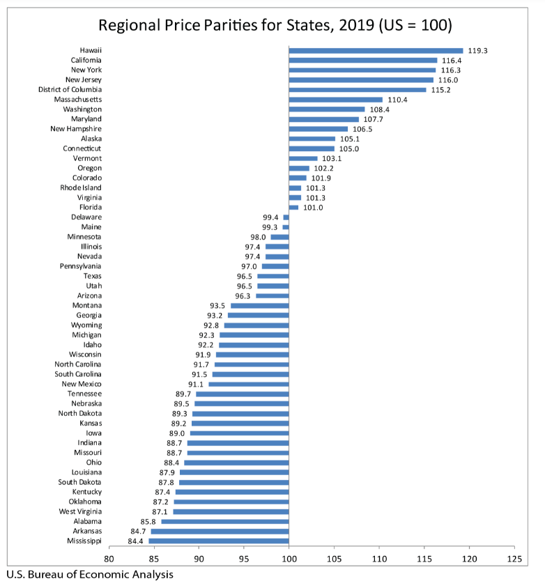

# Real per capita personal income and income growth

## Prosperity & Well Being

### **Goal**

Economic growth

Texas spurs economic growth through an innovative and business-friendly climate

### **Value**

| Year        |  Value      | Rank     | Previous Year   | Previous Value | Previous Rank | Trend | 
| ----------- | ----------- | ----------- | ----------- | ----------- | ----------- | -----------|
|    2019     |     3.0%     | N/A         |   2018      |     4.4%     | N/A         |          | 

### Data

### Source

[BEA -2019](https://www.bea.gov/news/2020/real-personal-income-state-and-metropolitan-area-2019)

[BEA 2018](https://www.bea.gov/news/2020/real-personal-income-state-and-metropolitan-area-2018)

### Notes

### Indicator Page

[Indicator Link](https://indicators.texas2036.org/indicator/31)

### DataLab Page

[DataLab Link](https://datalab.texas2036.org/gwhhipb/quarterly-state-level-personal-income-u-s?accesskey=vuwvpcc)

