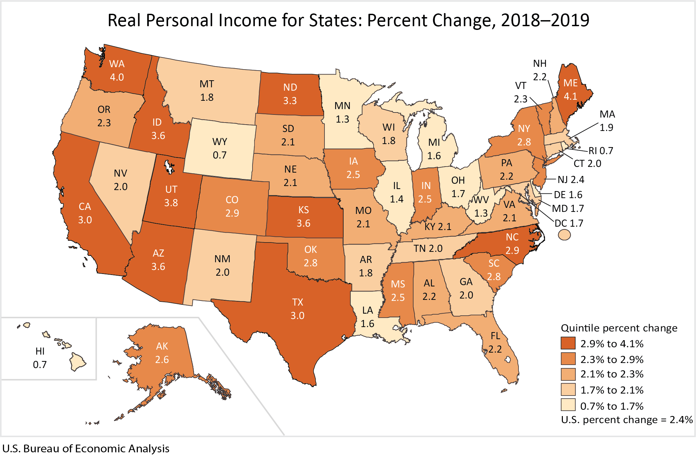
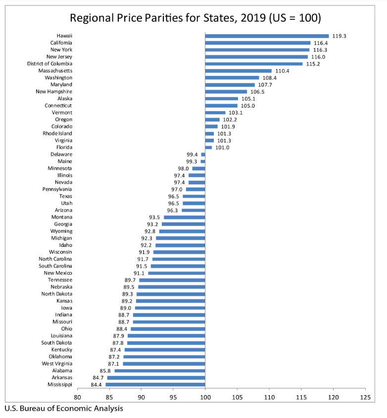

# Per capita income

Real per capita personal income and income growth

## Prosperity

### Goal: Quality of life

Texas is the best place to live and work

### Type: Secondary indicator

Updated: yes

Data Release Date: 

Comparisons: States

Date: 2019

Latest Value: 3.0% 

State Rank: N/A

Peer Rank: 

Previous Date: 2018

Previous Value: 4.4%

Previous State Rank: N/A

Metric Trend: down

Target: 

Baseline: 

Previous Target Value: 

Previous Trend: 

Previous Peer Rank: 

Previous State Rank (og): 

### Value

| Year        |  Value      | Rank     | Previous Year   | Previous Value | Previous Rank | Trend | 
| ----------- | ----------- | ----------- | ----------- | ----------- | ----------- | -----------|
|    2019     |     3.0%     | N/A         |   2018      |     4.4%     | N/A         |  down    | 

### Data

### Source

[BEA -2019](https://www.bea.gov/news/2020/real-personal-income-state-and-metropolitan-area-2019)

[BEA 2018](https://www.bea.gov/news/2020/real-personal-income-state-and-metropolitan-area-2018)

### Notes

### Indicator Page

[Indicator Link](https://indicators.texas2036.org/indicator/31)

### DataLab Page

[DataLab Link](https://datalab.texas2036.org/gwhhipb/quarterly-state-level-personal-income-u-s?accesskey=vuwvpcc)

