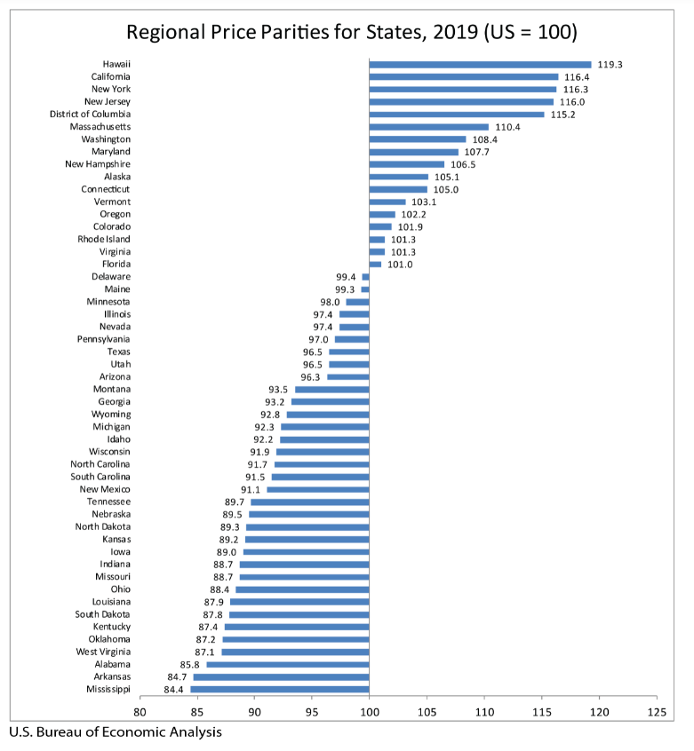
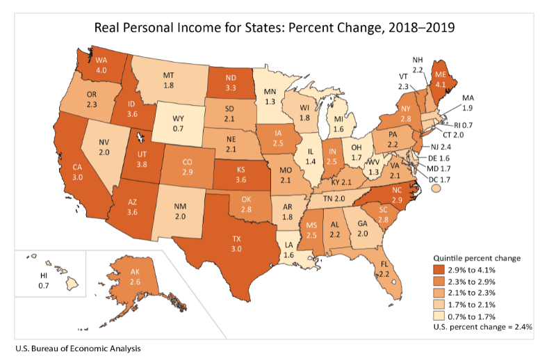
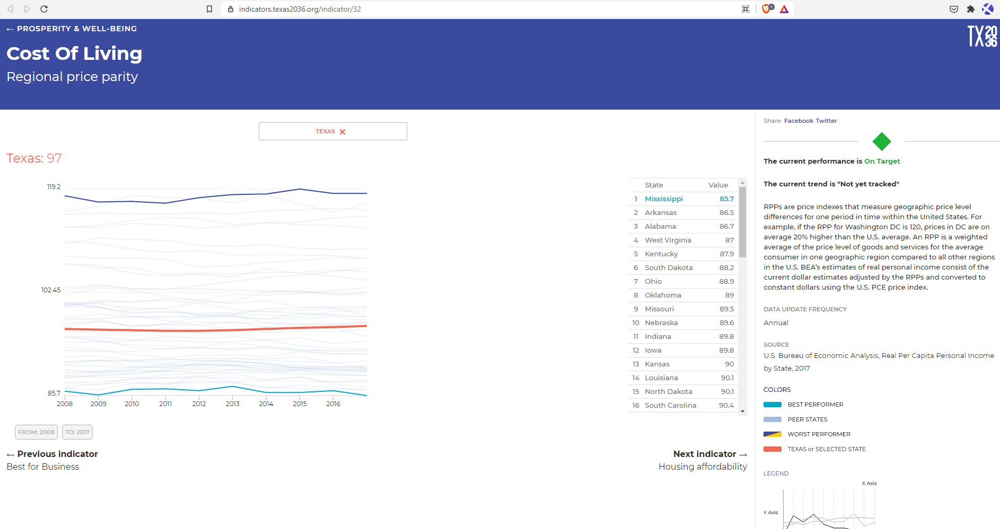
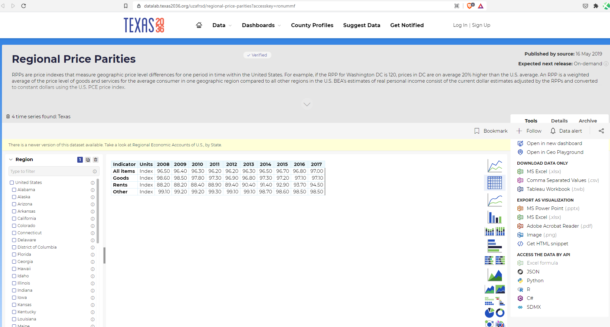

# Cost of living

Regional price parity

## Prosperity

### Goal: Quality of life

Texas is the best place to live and work

### Type: Secondary indicator

Updated: yes

Data Release Date: Annually - December 15, 2020

Comparisons: States

----

Date: 2019

Latest Value: 96.5 

State Rank: 27

Peer Rank: 

----

Previous Date: 2018

Previous Value: 96.5

Previous State Rank: 28

Previous Peer Rank: 

----
Metric Trend: flat

Target: 

Baseline: 

Target Value: 

Previous Trend: 

### Value

| Year |  Value      | Rank     | Previous Year   | Previous Value | Previous Rank | Trend | 
| ----------- | ----------- | ----------- | ----------- | ----------- | ----------- | -----------|
|    2019     |    96.5     | 23          |    2018     |    96.5     | N/A         | flat       | 

### Data

### Source

[BEA](https://www.bea.gov/data/prices-inflation/regional-price-parities-state-and-metro-area)

### Notes

### Indicator Page

[Indicator Link](https://indicators.texas2036.org/indicator/32)

### DataLab Page

[DataLab Link](https://datalab.texas2036.org/uzafrsd/regional-price-parities?accesskey=ronummf)

