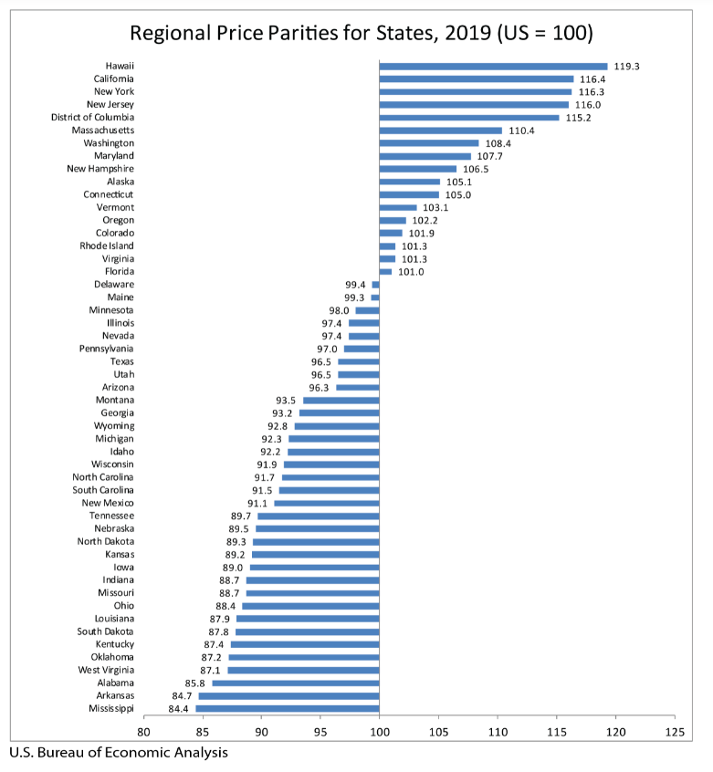
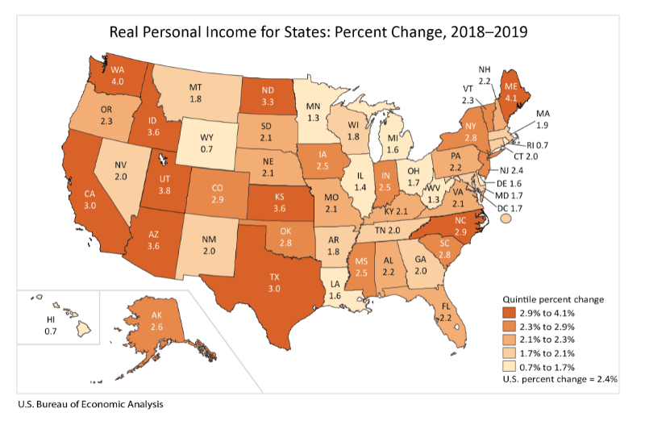
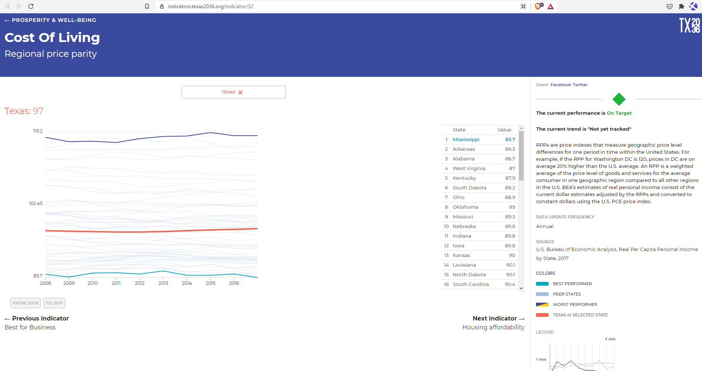
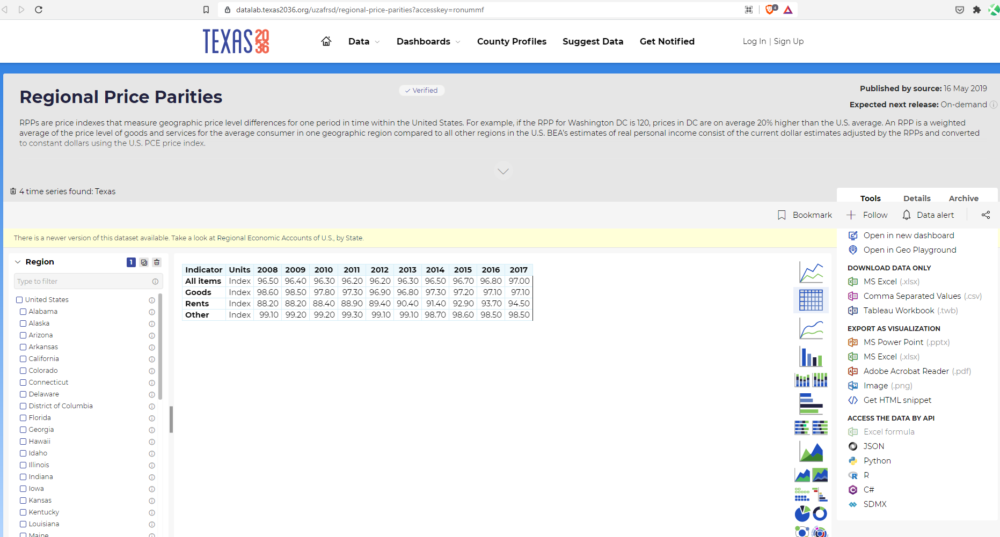

# Cost of living
Regional price parity
## Prosperity
### Goal: Quality of life
Texas is the best place to live and work
### Type: Secondary indicator
Updated: yes
Data Release Date: 

Comparisons: States

Date: 2019

Latest Value: 96.5 

State Rank: 23

Peer Rank: 

Previous Date: 2018

Previous Value: 96.5

Previous State Rank: N/A

Metric Trend: flat

Target: 

Baseline: 

Previous Target Value: 

Previous Trend: 

Previous Peer Rank: 

Previous State Rank (og): 

### Value

| Year |  Value      | Rank     | Previous Year   | Previous Value | Previous Rank | Trend | 
| ----------- | ----------- | ----------- | ----------- | ----------- | ----------- | -----------|
|    2019     |    96.5     | 23          |    2018     |    96.5     | N/A         | flat       | 

### Data

### Source

[BEA](https://www.bea.gov/news/2020/real-personal-income-state-and-metropolitan-area-2019)

### Notes

### Indicator Page

[Indicator Link](https://indicators.texas2036.org/indicator/32)

### DataLab Page

[DataLab Link](https://datalab.texas2036.org/uzafrsd/regional-price-parities?accesskey=ronummf)

