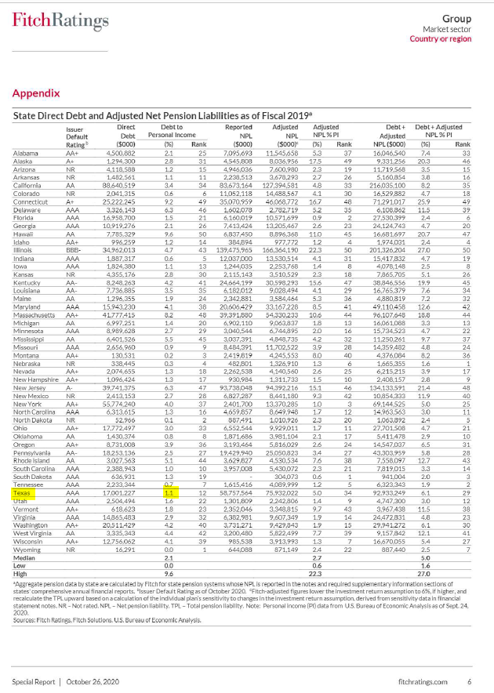

# Long-Term Liabilities

Tax-Supported Debt and Net Pension Liabilities as a Percentage of Total State Personal Income

## Fiscal Sustainability

### Goal: Wisely managed state spending

Texas strategically manages state expenditures to deliver the best value to taxpayers

### Type: Primary indicator

Updated: no

Data Release Date: October 2020

Comparisons: States

### Value

| Year |  Value      | Rank     | Previous Year   | Previous Value | Previous Rank | Trend | 
| ----------- | ----------- | ----------- | ----------- | ----------- | ----------- | -----------|
|   2019      |     1.1%    |      12     |             |             | N/A         |          | 

### Data

### Source

[Fitch](https://www.grsconsulting.com/2020/10/28/fitch-ratings-releases-2020-state-liability-report/)

### Notes

### Indicator Page

### DataLab Page

